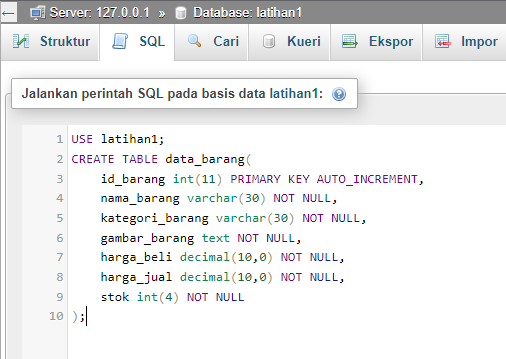
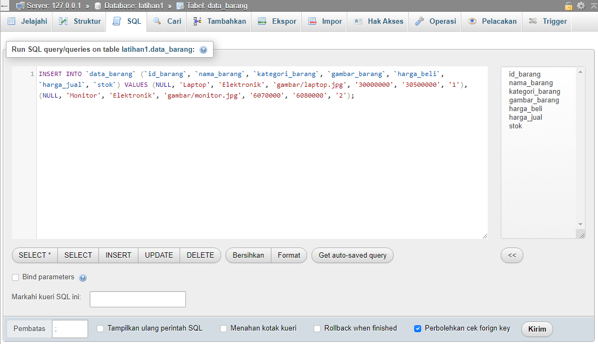
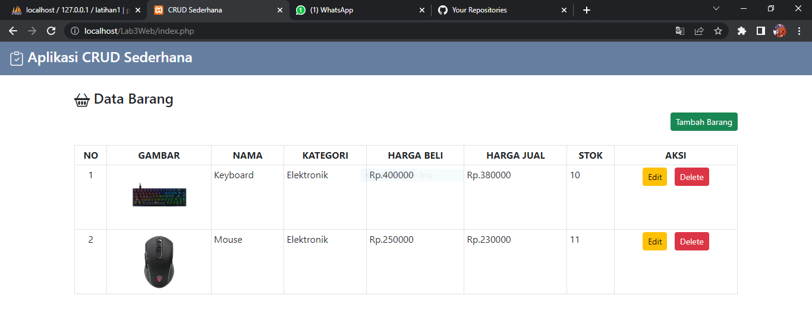
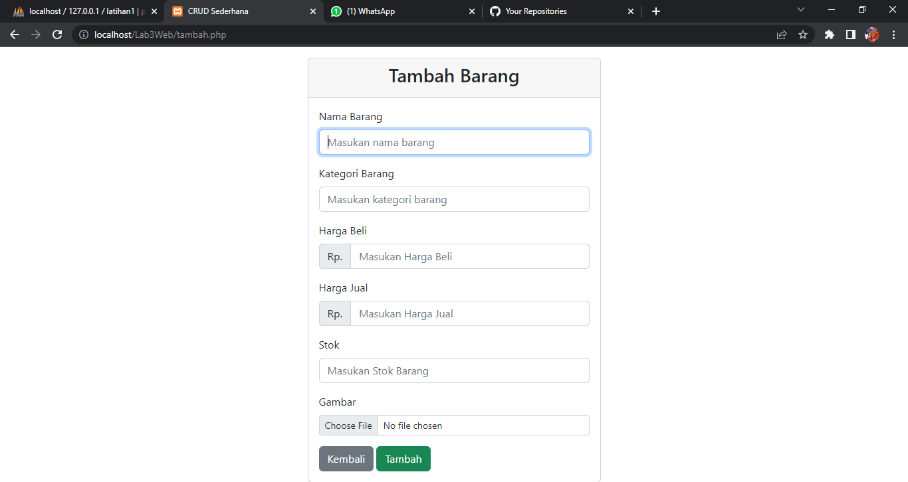
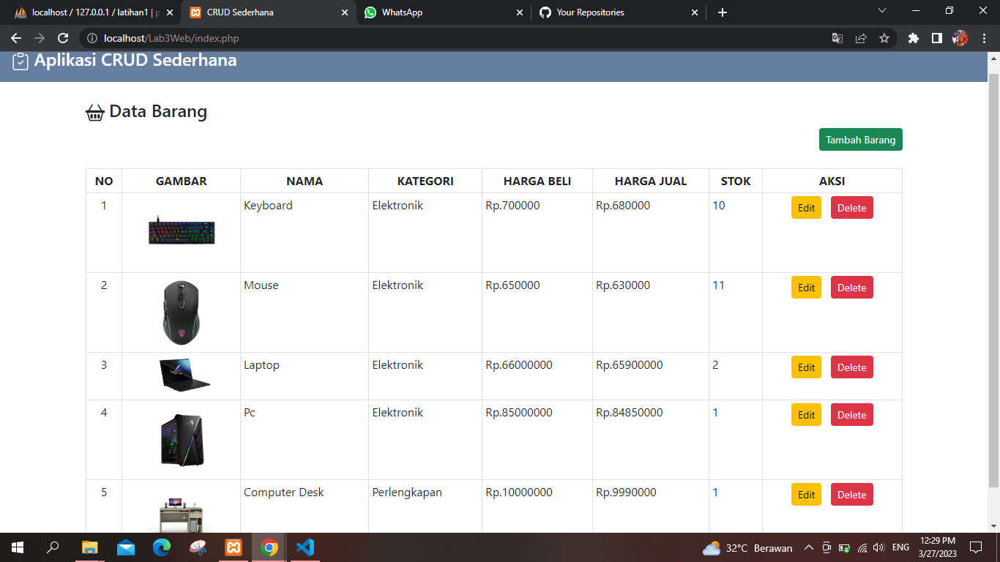
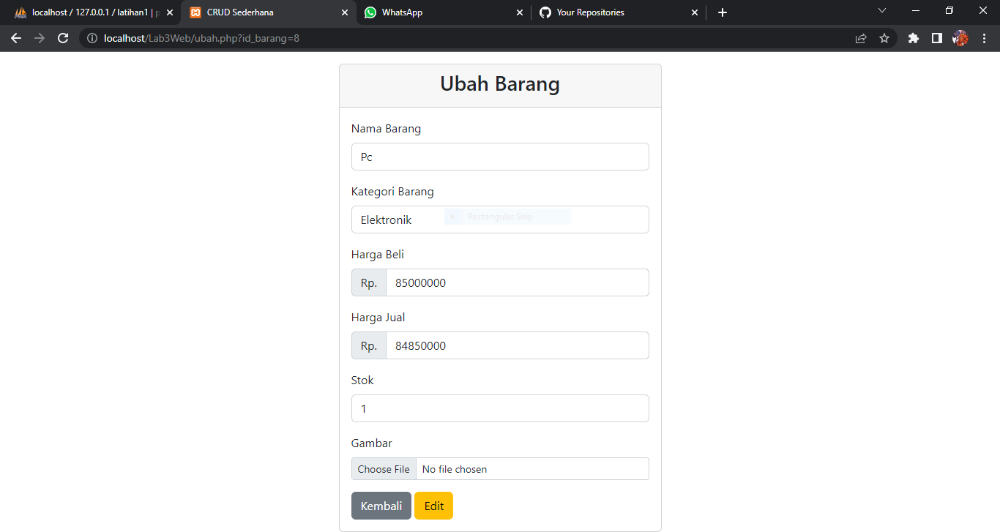
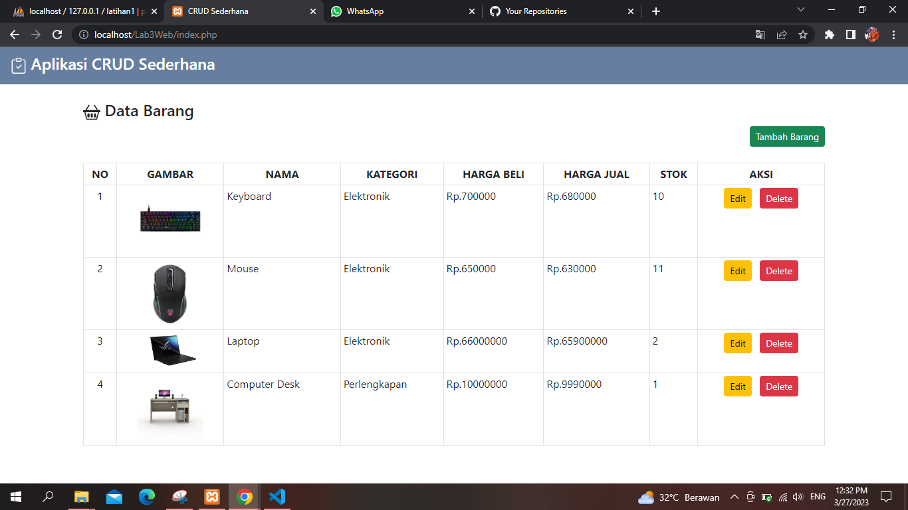

# Tugas Pemograman Web 2
## Profil
| #               | Biodata           |
| --------------- | ----------------- |
| **Nama**        | Afif Firmansyah   |
| **NIM**         | 312110232         |
| **Kelas**       | TI.21.A.1         |
| **Mata Kuliah** | Pemrograman Web 2 |

# Persiapan
<p>Untuk memulai membuat aplikasi CRUD sederhana, yang perlu disiapkan adalah database server menggunakan MySQL. Pastikan MySQL Server sudah dapat dijalankan melalui XAMPP.</p>

## Menjalankan MySQL Server
- Untuk menjalankan MySQL Server dari menu XAMPP Contol.
- Pastikan Web server Apache dan MySQL Server sudah dijalankan. Kemudian buka melalui browser: http://localhost/phpmyadmin/

### Membuat Database
1. Pilih menu `Databases` lalu masukan nama file tersebut (latihan1) dan klik Create.

2. Ataupun bisa juga pilih menu `SQL` lalu jalankan perintah berikut.

```sql
CREATE DATABASE latihan1;
```

3. Kemudian buat `Table` dengan cara klik menu `SQL` lagi, kemudian masukan perintah berikut.

```sql
USE latihan1;
CREATE TABLE data_barang(
    id_barang int(11) PRIMARY KEY AUTO_INCREMENT,
    nama_barang varchar(30) NOT NULL,
    kategori_barang varchar(30) NOT NULL,
    gambar_barang text NOT NULL,
    harga_beli decimal(10,0) NOT NULL,
    harga_jual decimal(10,0) NOT NULL,
    stok int(4) NOT NULL
);
```



4. Setelah itu, Tambahkan data dalam table tersebut dengan memasukan perintah berikut.

```sql
INSERT INTO `data_barang` (`id_barang`, `nama_barang`, `kategori_barang`, `gambar_barang`, `harga_beli`, `harga_jual`, `stok`) VALUES (NULL, 'Laptop', 'Elektronik', 'gambar/laptop.jpg', '30000000', '30500000', '1'), (NULL, 'Monitor', 'Elektronik', 'gambar/monitor.jpg', '6070000', '6080000', '2');
```



### Membuat Program CRUD
1. Buat folder Lab3Web pada root directory Web server (C:\xampp\htdocs)
2. Kemudian buat file baru dengan nama `koneksi.php`, Lalu masukan kode berikut.

```php
<?php
$koneksi = mysqli_connect('localhost', 'root', '', 'latihan1');

if ($koneksi == false) {
    echo "Koneksi gagal";
    die();
} 

// var_dump($koneksi);
```

3. Jika gambarnya seperti ini maka berhasil koneksi ke database. Untuk menyampilkan pesan koneksi berhasil,
uncomment pada perintah var_dump($koneksi);


### Menampilkan Data (Read)
- Buat file baru dengan nama `index.php`, Kemudian masukan kode berikut.

```php
<?php
include "koneksi.php";

$query = "SELECT * FROM data_barang";
$result = mysqli_query($koneksi, $query);
?>

<!DOCTYPE html>
<html lang="en">
  <head>
    <meta charset="UTF-8" />
    <meta http-equiv="X-UA-Compatible" content="IE=edge" />
    <meta name="viewport" content="width=device-width, initial-scale=1.0" />
    <title>CRUD Sederhana</title>

    <link
      rel="stylesheet"
      href="https://cdn.jsdelivr.net/npm/bootstrap@5.2.0-beta1/dist/css/bootstrap.min.css"
    />
  </head>

  <body>
    <div>
      <h4 class="py-2 px-3" style="background-color: #667fa0; color: white;">
        <!-- <svg xmlns="http://www.w3.org/2000/svg" width="24" height="24" fill="currentColor" class="bi bi-clipboard-check my-2" viewBox="0 0 16 16">
        <path fill-rule="evenodd" d="M10.854 7.146a.5.5 0 0 1 0 .708l-3 3a.5.5 0 0 1-.708 0l-1.5-1.5a.5.5 0 1 1 .708-.708L7.5 9.793l2.646-2.647a.5.5 0 0 1 .708 0z"/>
        <path d="M4 1.5H3a2 2 0 0 0-2 2V14a2 2 0 0 0 2 2h10a2 2 0 0 0 2-2V3.5a2 2 0 0 0-2-2h-1v1h1a1 1 0 0 1 1 1V14a1 1 0 0 1-1 1H3a1 1 0 0 1-1-1V3.5a1 1 0 0 1 1-1h1v-1z"/>
        <path d="M9.5 1a.5.5 0 0 1 .5.5v1a.5.5 0 0 1-.5.5h-3a.5.5 0 0 1-.5-.5v-1a.5.5 0 0 1 .5-.5h3zm-3-1A1.5 1.5 0 0 0 5 1.5v1A1.5 1.5 0 0 0 6.5 4h3A1.5 1.5 0 0 0 11 2.5v-1A1.5 1.5 0 0 0 9.5 0h-3z"/>
        </svg> --> Aplikasi CRUD Sederhana</h4> 
    </div>
    <div class="container">
      <h4 class="mt-4">
        <!-- <svg xmlns="http://www.w3.org/2000/svg" width="26" height="26" fill="currentColor" class="bi bi-basket2" viewBox="0 0 16 16">
        <path d="M4 10a1 1 0 0 1 2 0v2a1 1 0 0 1-2 0v-2zm3 0a1 1 0 0 1 2 0v2a1 1 0 0 1-2 0v-2zm3 0a1 1 0 1 1 2 0v2a1 1 0 0 1-2 0v-2z"/>
        <path d="M5.757 1.071a.5.5 0 0 1 .172.686L3.383 6h9.234L10.07 1.757a.5.5 0 1 1 .858-.514L13.783 6H15.5a.5.5 0 0 1 .5.5v1a.5.5 0 0 1-.5.5h-.623l-1.844 6.456a.75.75 0 0 1-.722.544H3.69a.75.75 0 0 1-.722-.544L1.123 8H.5a.5.5 0 0 1-.5-.5v-1A.5.5 0 0 1 .5 6h1.717L5.07 1.243a.5.5 0 0 1 .686-.172zM2.163 8l1.714 6h8.246l1.714-6H2.163z"/>
        </svg> --> Data Barang</h4>
      <a href="tambah.php" class="btn btn-success btn-sm mb-4 float-end">Tambah Barang</a>

      <table class="table table-sm table-bordered">
        <tr class="text-center fw-bold text-uppercase">
          <td>No</td>
          <td>Gambar</td>
          <td>Nama</td>
          <td>Kategori</td>
          <td>Harga Beli</td>
          <td>Harga Jual</td>
          <td>Stok</td>
          <td>Aksi</td>
        </tr>
        <?php
        if ($result->num_rows > 0) { 
          
          // die(); 
          $no = 1; 
          while ($data = mysqli_fetch_array($result)) { 
            // var_dump($data['nama_barang']); 
            ?>
        <tr>
          <td class="text-center"><?= $no++ ?></td>
          <td class="text-center">
            "
              alt="<?= $data['nama_barang'];?>"
              width="100px" />
          </td>
          <td><?= $data['nama_barang'] ?></td>
          <td><?= $data['kategori_barang'] ?></td>
          <td>
            Rp.<?= $data['harga_beli'] ?>
          </td>
          <td>
            Rp.<?= $data['harga_jual'] ?>
          </td>
          <td><?= $data['stok'] ?></td>
          <td class="text-center">
            <a
              href="ubah.php?id_barang=<?= $data['id_barang'] ?>"
              class="btn btn-warning btn-sm mx-1">Edit</a>
            <a
              href="proses.php?id_barang=<?= $data['id_barang'] ?>&aksi=hapus"
              class="btn btn-danger btn-sm mx-1">Delete</a>
          </td>
        </tr>
        <?php
                }
            } else {
                ?>
        <tr>
          <td colspan="8" class="text-center">Data Kosong</td>
        </tr>
        <?php
            }
            ?>
      </table>
    </div>
  </body>
</html>
```

- Maka hasilnya akan seperti berikut.



### Menambah Data (Create)
- Buat file baru dengan nama `tambah.php`, Kemudian masukan kode berikut.

```html
<!DOCTYPE html>
<html lang="en">
  <head>
    <meta charset="UTF-8" />
    <meta http-equiv="X-UA-Compatible" content="IE=edge" />
    <meta name="viewport" content="width=device-width, initial-scale=1.0" />
    <title>CRUD Sederhana</title>
    <link
      rel="stylesheet"
      href="https://cdn.jsdelivr.net/npm/bootstrap@5.2.0-beta1/dist/css/bootstrap.min.css"/>
  </head>
  <body>
    <div class="container">
      <div class="row m-0">
        <div class="col-md-5 mx-auto">
          <div class="card mt-3">
            <div class="card-header text-center">
              <h3>Tambah Barang</h3>
            </div>
            <div class="card-body">
              <form
                action="proses.php"
                method="post"
                enctype="multipart/form-data">
                <div class="mb-3">
                  <label for="nama_barang" class="form-label">Nama Barang</label>
                  <input
                    type="text"
                    name="nama_barang"
                    id="nama_barang"
                    placeholder="Masukan nama barang"
                    class="form-control"/>
                </div>
                <div class="mb-3">
                  <label for="kategori_barang" class="form-label">Kategori Barang</label>
                  <input
                    type="text"
                    name="kategori_barang"
                    id="kategori_barang"
                    placeholder="Masukan kategori barang"
                    class="form-control"/>
                </div>

                <label for="harga_beli" class="form-label">Harga Beli</label>
                <div class="input-group mb-3">
                  <span class="input-group-text">Rp.</span>
                  <input
                    type="number"
                    name="harga_beli"
                    id="harga_beli"
                    placeholder="Masukan Harga Beli"
                    class="form-control"/>
                </div>

                <label for="harga_jual" class="form-label">Harga Jual</label>
                <div class="input-group mb-3">
                  <span class="input-group-text">Rp.</span>
                  <input
                    type="number"
                    name="harga_jual"
                    id="harga_jual"
                    placeholder="Masukan Harga Jual"
                    class="form-control"/>
                </div>

                <div class="mb-3">
                  <label for="stok" class="form-label">Stok</label>
                  <input
                    type="number"
                    class="form-control"
                    name="stok"
                    placeholder="Masukan Stok Barang"/>
                </div>

                <div class="mb-3">
                  <label for="gambar" class="form-label">Gambar</label>
                  <input
                    type="file"
                    name="gambar_barang"
                    id="gambar"
                    class="form-control form-control-sm"/>
                </div>

                <a href="index.php" class="btn btn-secondary">Kembali</a>
                <button class="btn btn-success" name="tambah" type="submit">
                  Tambah
                </button>
              </form>
            </div>
          </div>
        </div>
      </div>
    </div>
  </body>
</html>
```

- Maka hasilnya akan seperti berikut.



- Kemudian, tambahkan file baru dengan nama `proses.php` yang mana fungsi ini akan digunakan untuk memproses semuanya.
- Masukan kode berikut.

```php
<?php
include "koneksi.php";

if ($_SERVER["REQUEST_METHOD"] == "POST") {
    // -- Tambah Barang -- 
    if (isset($_POST['tambah'])) {
        $input = (object) $_POST;

        $nama_barang = ucwords(strtolower($input->nama_barang));
        $kategori_barang = ucwords(strtolower($input->kategori_barang));
        $harga_beli = $input->harga_beli;
        $harga_jual = $input->harga_jual;
        $stok = $input->stok;
        $file_gambar = $_FILES['gambar_barang'];
        $gambar = NULL;
        
        if ($file_gambar['error'] == 0) {
            $nama_gambar = str_replace(' ', '_', $file_gambar['name']);
            $path = dirname(__FILE__) . '/gambar/' . $nama_gambar;

            if (move_uploaded_file($file_gambar['tmp_name'], $path)) {
                $gambar = $nama_gambar;
            }
        }
        
        $query = "INSERT INTO data_barang (nama_barang, kategori_barang, harga_beli, harga_jual, stok, gambar_barang) ";
        $query .= "VALUE ('$nama_barang', '$kategori_barang', '$harga_beli', '$harga_jual', '$stok', '$gambar') ";
        
        $result = mysqli_query($koneksi, $query);
        
        header('location:index.php');

        // -- Ubah Barang -- 
    } else if (isset($_POST['ubah'])) {
        $input = (object) $_POST;
        
        $nama_barang = ucwords(strtolower($input->nama_barang));
        $kategori_barang = ucwords(strtolower($input->kategori_barang));
        $harga_beli = $input->harga_beli;
        $harga_jual = $input->harga_jual;
        $stok = $input->stok;
        $file_gambar = $_FILES['gambar_barang'];
        $gambar = NULL;

        if ($file_gambar['error'] == 0) {
            $nama_gambar = str_replace(' ', '_', $file_gambar['name']);
            $path = dirname(__FILE__) . '/gambar/' . $nama_gambar;

            if (move_uploaded_file($file_gambar['tmp_name'], $path)) {
                $gambar = $nama_gambar;
            }
        }
        
        $query = "UPDATE data_barang SET nama_barang = '$nama_barang', kategori_barang = '$kategori_barang', harga_beli = '$harga_beli', harga_jual = '$harga_jual', stok = '$stok'";

        if (!empty($gambar)) {
            $query .= ", gambar_barang = '$gambar' ";
        }
        $query .= "WHERE id_barang = $input->id_barang"; 
        $result = mysqli_query($koneksi, $query);
        
        header('location:index.php');
    }
```

- Jika berhasil, maka data baru sukses ditambahkan.



### Mengubah Data (Update)
- Buat file baru dengan nama `ubah.php`, Kemudian masukan kode berikut.

```php
<!DOCTYPE html>
<html lang="en">
  <head>
    <meta charset="UTF-8" />
    <meta http-equiv="X-UA-Compatible" content="IE=edge" />
    <meta name="viewport" content="width=device-width, initial-scale=1.0" />
    <title>CRUD Sederhana</title>
    <link
      rel="stylesheet"
      href="https://cdn.jsdelivr.net/npm/bootstrap@5.2.0-beta1/dist/css/bootstrap.min.css"/>
  </head>
  <body>
    <div class="container">
      <div class="row m-0">
        <div class="col-md-5 mx-auto">
          <div class="card mt-3">
            <div class="card-header text-center">
              <h3>Ubah Barang</h3>
            </div>
            <div class="card-body">
              <?php
                        include "koneksi.php";

                        $id = $_GET['id_barang'];
                        $query = "SELECT * FROM data_barang ";
                        $query .= "WHERE id_barang = $id";

                        $result = mysqli_query($koneksi, $query);
                        $data = mysqli_fetch_array($result);
                        ?>
              <form
                action="proses.php"
                method="post"
                enctype="multipart/form-data">
                <input type="hidden" name="id_barang" value="<?= $id ?>" />
                <div class="mb-3">
                  <label for="nama_barang" class="form-label">Nama Barang</label>
                  <input
                    type="text"
                    name="nama_barang"
                    id="nama_barang"
                    placeholder="Masukan nama barang"
                    class="form-control"
                    value="<?= $data['nama_barang'] ?>"/>
                </div>
                <div class="mb-3">
                  <label for="kategori_barang" class="form-label">Kategori Barang</label>
                  <input
                    type="text"
                    name="kategori_barang"
                    id="kategori_barang"
                    placeholder="Masukan kategori barang"
                    class="form-control"
                    value="<?= $data['kategori_barang']?>"/>
                </div>

                <label for="harga_beli" class="form-label">Harga Beli</label>
                <div class="input-group mb-3">
                  <span class="input-group-text">Rp.</span>
                  <input
                    type="number"
                    name="harga_beli"
                    id="harga_beli"
                    placeholder="Masukan Harga Beli"
                    class="form-control"
                    value="<?= $data['harga_beli']?>"/>
                </div>

                <label for="harga_jual" class="form-label">Harga Jual</label>
                <div class="input-group mb-3">
                  <span class="input-group-text">Rp.</span>
                  <input
                    type="number"
                    name="harga_jual"
                    id="harga_jual"
                    placeholder="Masukan Harga Jual"
                    class="form-control"
                    value="<?= $data['harga_jual']?>"/>
                </div>

                <div class="mb-3">
                  <label for="stok" class="form-label">Stok</label>
                  <input
                    type="number"
                    class="form-control"
                    name="stok"
                    placeholder="Masukan Stok Barang"
                    value="<?= $data['stok']?>"/>
                </div>

                <div class="mb-3">
                  <label for="gambar" class="form-label">Gambar</label>
                  <input
                    type="file"
                    name="gambar_barang"
                    id="gambar"
                    class="form-control form-control-sm"
                    value="<?= $data['gambar_barang']?>"/>
                </div>

                <a href="index.php" class="btn btn-secondary">Kembali</a>
                <button class="btn btn-warning" name="ubah" type="submit">
                  Edit
                </button>
              </form>
            </div>
          </div>
        </div>
      </div>
    </div>
  </body>
</html>
```

- Maka hasilnya akan seperti berikut.



### Menghapus Data (Delete)
- Pada button delete, Ubah hrefnya ke `proses.php` dengan membawa 2 parameter yaitu id_barang dan aksi.
- Tambahkan kode berikut ke dalam file `proses.php`.

```php
    // -- Hapus barang --
} else if (isset($_GET['id_barang']) && $_GET['aksi'] == "hapus") {

    $id = $_GET['id_barang'];
    $query = "DELETE FROM data_barang WHERE id_barang = $id";

    $result = mysqli_query($koneksi, $query);

    header('location:index.php');
}
```

- Maka hasilnya akan seperti berikut.



# Terima Kasih!!!